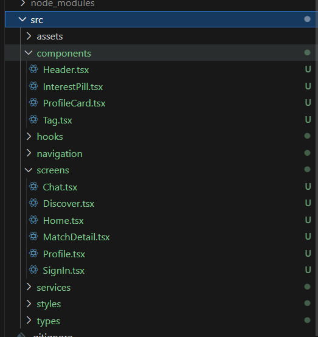
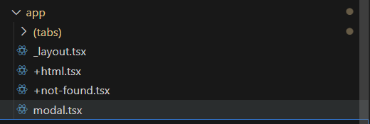

link to the app design- https://app.visily.ai/projects/514ff22a-ced7-44bb-a56b-7f874a55427f/boards/2246633 

document with steps how to commit to your branch - https://docs.google.com/document/d/1igj7pvgqhRIFYifud_TTqJmw24Oq4CgcTbXbSmxNKFQ/edit?usp=sharing

